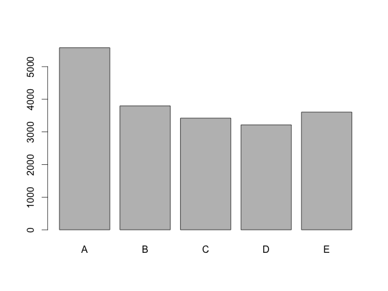
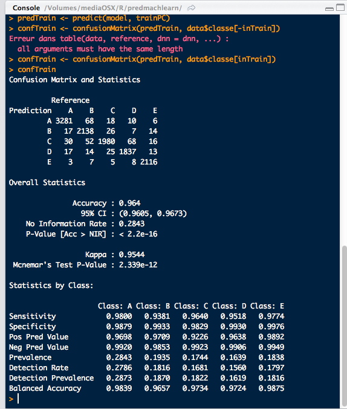
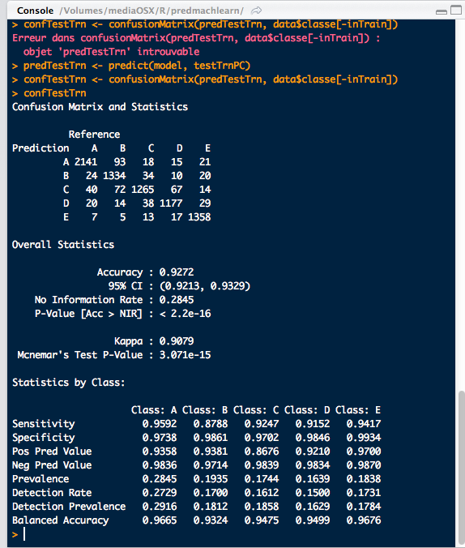

Predicitive machine learning week 3 assignment
===================

# Explore data 

## Load training data
```r
data <- read.csv("pml-testing.csv")
```

or better

```r
data <- read.csv("pml-training.csv", na.strings=c("NA","#DIV/0!"), as.is=6:154)
```

Since the presence of "#DIV/0!" (yeah Excel) in the data caused many variables to be imported as strings instead of floating point.

19622 observations and **160** variables :

1. No way all 160 variables are needed -> PCA should help.
2. The amount of observations seems to justify a standard 60-40 data split for model training.

First, take a look at what the variables are :

```r
data[1:5,]
```

* X is just an index (not relevant for classification)
* user_name is not relevant for classification
* timestamps are also not relevant for classification

Looks that the first 5 columns of the dataset can safely be excluded from the training set. There are also plenty of NA values. We could try to remove columns with only NA values, but it is faster to do this automatically with PCA than manually.

Now, let's look at the classe values, to check if we can spot any bias:

```r
data$classe
```

Whoa ! far too many values to look at in the console.
Plotting the distribution of classe values (with help from Roland on SO : http://stackoverflow.com/a/21639445)

```r
barplot(table(data$classe))
```



The training data may be slightly skewed towards class A, but this does not seem problematic since :

1. the skew is not that large
2. there is a fair chance that class "A" is the "at rest" class, which will probably also be the most frequent in the general case.

# Preprocess data with PCA

## Load caret and kernlab
```r
library(caret)
library(kernlab)
```

## Create training set
`set.seed(3433)` using fixed seed for repeatable results while debugging

```r
inTrain = createDataPartition(data$classe, p = 6/10)[[1]]
training <- data[inTrain, 6:159]
testTrn <- data[-inTrain, 6:159]
```

## Clean-up training data
A couple of issues here :

* many columns have mostly NA values, it makes no sense to use those
* 3 columns have zero variance, and are therefore uselsee in classification
* the new_window column contains yes/no instead of a numeric value

### Transforming new_window into logical values
```r
newW <- charmatch(training$new_window, c("yes","no"))
trainSafe <- training
trainSafe$new_window <- newW
```

### Removing columns with more than 80% NA
```r
naCols <- colSums(is.na(trainSafe))
goodCols <- as.vector(naCols)/dim(trainSafe)[2] < 0.2
nGoodCols <- sum(goodCols)
```

```r
badColNames <- names(trainSafe)
badColNames <- badColNames[!goodCols]
badColNames <- badColNames[!is.na(badColNames)]
```

```r
trainSafeNA <- trainSafe[, !names(trainSafe) %in% badColNames ]
```

### Removing zero variance columns
Very similar too removing columns with too many NA, only the condition is different

```r
varCols <- apply(trainSafeNA, 2, var, na.rm=TRUE)
goodCols <- abs(as.vector(varCols)) > 1e-3
```

```r
badColNames <- names(trainSafeNA)
badColNames <- badColNames[!goodCols]
badColNames <- badColNames[!is.na(badColNames)]
```

```r
trainSafeVar <- trainSafeNA[, !names(trainSafeNA) %in% badColNames ]
```

## Perform PCA on training data
```r
preProc <- preProcess(trainSafeVar, thresh=0.85, method="pca")
```

Here, a 85% threshold was chosen. This results in keeping only 16 PC variables.

Compute those PC variables for the training set :

```r
trainPC <- predict(preProc, trainSafeVar)
```

## Train a model based on PC coefficients
```r
model <- train(x=trainPC, y=data$classe[inTrain], method="knn", metric="Accuracy")
```

This takes quite some time. Here a k- nearest neighbors model was chosen. This seems more sensible than a generalized linear model since there is no reason to have linear separations between activities.

### Check in-sample error
The confusion matrix can be obtained by comparing the model predictions to the ground truth :

```r
predTrain <- predict(model, trainPC)
confTrain <- confusionMatrix(predTrain, data$classe[inTrain])
```



The observed in-sample accuracy is 96.4% and the Kappa is 95.4%, which are both very good. This should raise the question of overfitting to the training data. To make sure that we did not overfit, we need to get similar figure for test data.

## Cross-validation
For cross-validation, I will use a 5-fold resampling, and observe the behavior for accuracy and Kappa.
```r
cvFolds <- createFolds(1:dim(trainPC)[1],5)

i <- 0 
resFolds <- NULL
cvAccuracy <- NULL
cvKappa <- NULL
for(fold in cvFolds){
  trainFolds <- trainPC[-fold,]
  testFolds <- trainPC[fold,]
  
  ## train KNN model
  modelFolds <- train(x=trainFolds, y=data$classe[inTrain[-fold]], method="knn", metric="Accuracy")
  predFolds <- predict(modelFolds, testFolds)
  confFolds <- confusionMatrix(predFolds, data$classe[inTrain[fold]])
  save(confFolds, file="confFolds.rdt")
  i <- i + 1
  cvAccuracy[[i]] <- confFolds$overall[1]
  cvKappa[[i]] <- confFolds$overall[2]
  resFolds[[i]] <- confFolds
  save(resFolds, file="resFolds.rdt")
}
cvMeanAccuracy <- mean(cvAccuracy)
cvAccuracyStd <- std(cvAccuracy)
cvMeanKappa <- mean(cvKappa)
cvKappaStd <- std(cvKappa)
```
This cross-validation indicates that 90% accuracy can be expected !

## Predict values for test data
First, PC coefficients have to be computed for the test points.

```r
newW <- charmatch(testTrn$new_window, c("yes","no"))
testTrnSafe <- testTrn
testTrnSafe$new_window <- newW
testTrnNA <- testTrnSafe[, !names(testTrnSafe) %in% badColNamesNA ]
testTrnVar <- testTrnNA[, !names(testTrnNA) %in% badColNamesVar ]
testTrnPC <- predict(preProc, testTrnVar)
```

Finally the model can be used on these data points, and the confusion matrix can be displayed : 

```r
confTestTrn <- confusionMatrix(predTestTrn, data$classe[-inTrain])
```



Here again, the observed out-of-sample accuracy and Kappa are very good : 92.7% and 90.8% respectively.


# Prediction for assignment data
## Load and format the data
```r
dttest <- read.csv("pml-testing.csv", na.strings=c("NA","#DIV/0!"), as.is=6:154)
testing <- dttest[, 6:159]
newW <- charmatch(testing$new_window, c("yes","no"))
testSafe <- testing
testSafe$new_window <- newW
testNA <- testSafe[, !names(testSafe) %in% badColNamesNA ]
testVar <- testNA[, !names(testNA) %in% badColNamesVar ]
```

## PCA pre-processing
```r
testPC <- predict(preProc, testVar)
```

## Prediction
```r
predTest <- predict(model, testPC)
```

The result is the following :

```r
predTest
 [1] B A A A A E D C A A B C B A E E A B B B
Levels: A B C D E
```

## Formatting for submission files generation
```r
answers <- as.vector(predTest)
source("pml_write_files.R")
pml_write_files(answers)
```

## Feedback after submission
On these 20 testing cases, the k-nearest neighbors model developepd here gets 18 correct answers. This 90% accuracy is similar to what was expected for the out-of-sample error.

One could be tempted to improve the model in order to have 100% accuracy on this testing set. But this seems dangerous, since trying to better fit this 20 observation test vector could result in worse results for the general case.
